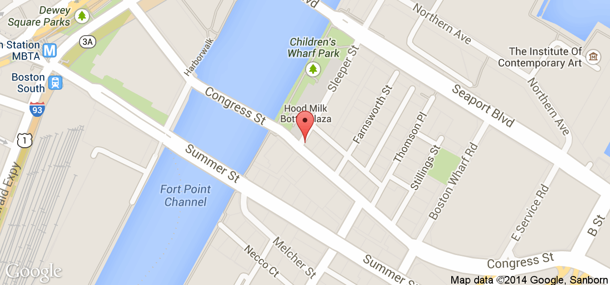

We'll be taking theme submissions from now until June 12th, and we will unveil the winner the first day of the event. Participants will then have the entire weekend to make a game, from scratch, based on the winning theme.

Free registration for the event is being done through our [EventBrite page](#). Remember to [submit your theme ideas here](/theme-submission/#form) before June 12th!

Any questions, feel free to email us: [boston-game-jam@cantina.co](mailto:boston-game-jam@cantina.co)

And remember to follow us on twitter [@purplemonkeygj](http://twitter.com/@purplemonkeygj)!

##Where

[320 Congress St. 1st Floor, Boston MA](https://www.google.com/maps/place/320+Congress+St/@42.3513087,-71.0496741,17z/data=!3m1!4b1!4m2!3m1!1s0x89e3707ffd0af36b:0xee01fba0b2b0a7f6)

##Schedule

June 14th

- **8:00am** - Doors Open / Breakfast
- **9:00am** - Keynote
- **12:00pm** - Lunch
- **8:00pm** - End of day

June 15th

- **8:00am** - Doors Open / Breakfast
- **12:00pm** - Lunch
- **5:00pm** - Demos
- **7:00pm** - End of event
